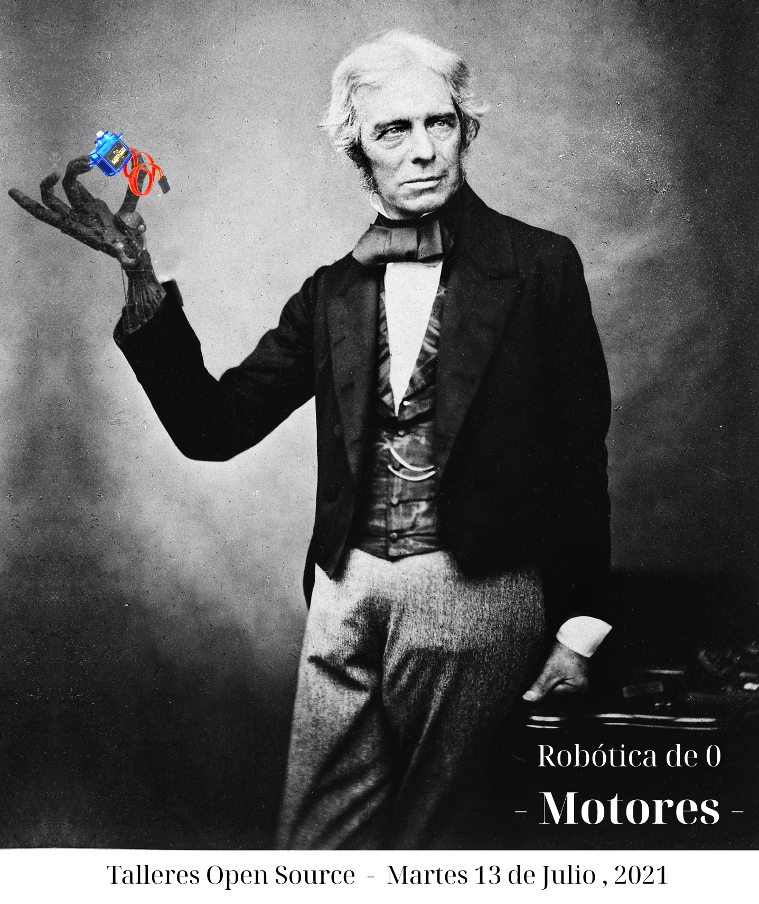

# Talleres Open Source: "Robótica desde cero"

Actividad [virtual] introductoria sobre motores DC, servos y steppers.

Hecha para los Talleres Open Source (ciclo 2, 2021: https://github.com/talleresopensource/ciclo-02).

